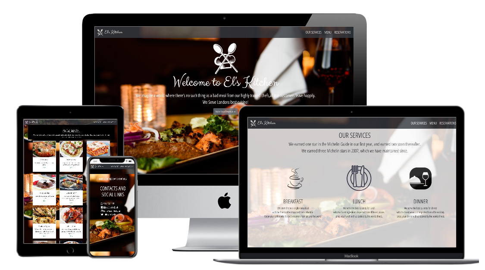

# Restaurant Website

> The main goal of this project is to show the understanding of the benefits of modularized code as well as the ability to set up a javascript application made of different modules using webpack.

# Live Demo

> Click [here](https://gallant-bell-11dd24.netlify.app/) for live demo

# Screenshot

## Built With
- HTML & CSS
- Bootstrap
- JavaScript/ES6
- Webpack
- eslint
- style lint

## Author

👤 **Elbie Moonga**

- GitHub: [@Elbie-Em](https://github.com/Elbie-em)
- Twitter: [ElbieEm](https://twitter.com/ElbieEm)
- LinkedIn: [elbie-moonga](https://www.linkedin.com/in/elbiemoonga/) 

## 🤝 Contributing

Contributions, issues and feature requests are welcome!

Feel free to check the [issues page](https://github.com/Elbie-em/Restaurant-Page-JS/issues).

## Show your support

Give a ⭐️ if you like this project!

## Acknowledgments

- Microverse
- The Odin Project

## 📝 License

This project is [MIT](./license.md) licensed.
